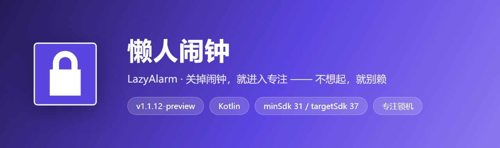
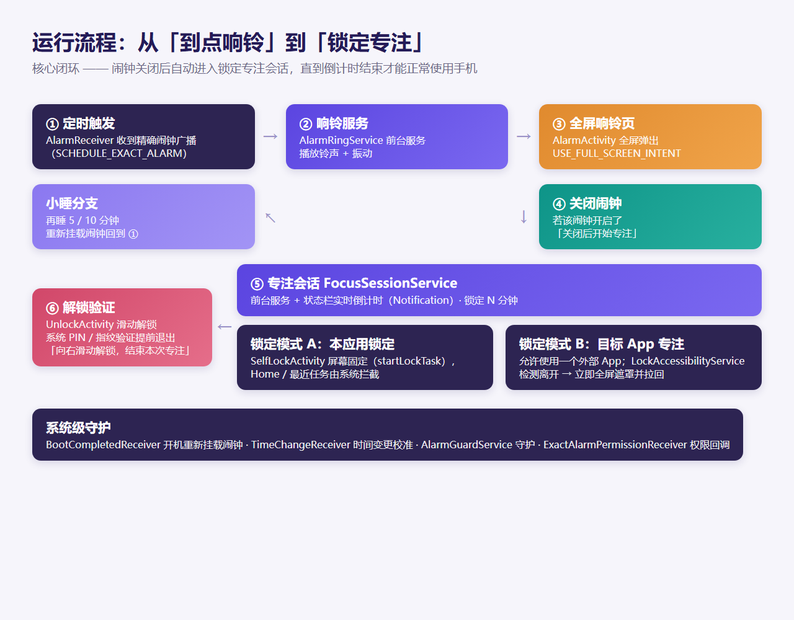
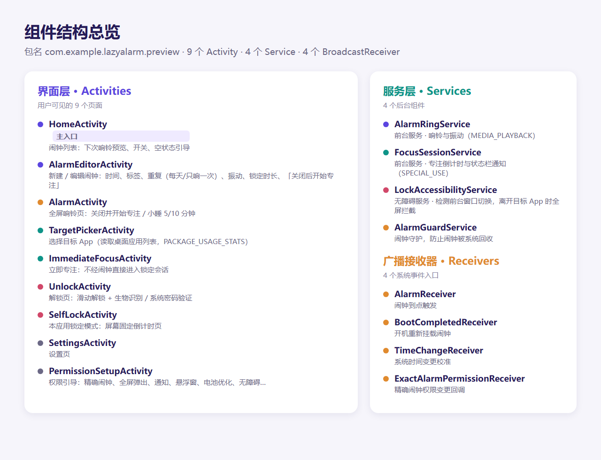

# 懒人闹钟预览版 APK 解析报告



> 本仓库是对 `懒人闹钟-新版预览.apk` 的逆向解析与结构分析报告，包含图标、运行流程图、组件结构图及完整权限清单。源 APK 未随仓库上传，仅用于静态分析。

---

## 1. 基础信息

| 项目 | 内容 |
|------|------|
| 应用名称 | 懒人闹钟预览 |
| 包名 | `com.example.lazyalarm.preview` |
| 版本名 / 版本号 | `1.1.12-preview` / `17` |
| 最低 SDK / 目标 SDK | `31` (Android 12) / `37` |
| 主入口 Activity | `com.example.lazyalarm.HomeActivity` |
| 开发语言 | Kotlin（5 个 classes.dex） |
| 编译特性 | 使用 AppCompat + Material 3 |
| APK 大小 | 14.95 MB |
| APK SHA-256 | `97df9a69dc33d24b1f9da32714376393e4d784567f8c6a6ffcc0f85515e15592` |
| 签名方式 | v2（Android Debug 证书，预览/调试包） |

## 2. 一句话定位

**「关掉闹钟，就进入专注」—— 到点响铃后，若用户选择关闭，可立即触发一段锁机倒计时，期间限制返回桌面、切出允许应用，并支持系统密码 / 指纹验证提前退出。**

## 3. 应用图标

这是 APK 内真实的矢量启动图标，按 `ic_launcher.xml` 1:1 渲染（48dp → 512px）：


- 主色：`#5B45E0`（深紫色）
- 图形：圆角方形底板 + 白色锁头
- 设计语言：简洁、圆润、强识别度

## 4. 主要功能

从资源字符串中还原出的用户可见功能：

| 模块 | 能力 |
|------|------|
| 闹钟管理 | 新建 / 编辑闹钟；支持「每天」或「只响一次」；标签、振动、下次响铃预览 |
| 响铃页 | 全屏弹出（`USE_FULL_SCREEN_INTENT`）；支持关闭并开始专注 / 小睡 5 分钟 / 小睡 10 分钟 |
| 专注锁定 | 关闭闹钟后进入倒计时锁定；可设定锁定分钟数；状态栏实时倒计时通知 |
| 锁定模式 A | **本应用锁定**：`startLockTask` 屏幕固定，系统拦截 Home / 最近任务 |
| 锁定模式 B | **目标 App 专注**：允许使用一个外部 App；离开后通过无障碍服务检测并全屏遮罩、尝试拉回 |
| 立即专注 | 不依赖闹钟，直接开启一段锁定会话 |
| 解锁验证 | 滑动解锁；提前退出需系统 PIN / 图案 / 密码或生物识别验证 |
| 权限引导 | 分步引导精确闹钟、全屏弹出、通知、悬浮窗、电池优化、无障碍等权限 |
| 系统守护 | 开机自启重新挂载闹钟、时间变更校准、AlarmGuardService 守护 |
| 电话兼容 | 可读取电话状态（可选），用于锁定期间接听来电，不读取通话记录 |

## 5. 运行流程图



流程关键点：

1. **精确闹钟触发** → `AlarmReceiver` → `AlarmRingService` 前台服务响铃 + 振动。
2. `AlarmActivity` 全屏弹出，用户可选择小睡或直接关闭。
3. 若该闹钟开启「关闭后开始专注」→ 进入 `FocusSessionService` 倒计时。
4. 根据锁定模式：本应用屏幕固定 或 监控单个目标 App。
5. 倒计时结束或验证通过 → `UnlockActivity` 解锁。

## 6. 组件结构总览



### 9 个 Activity

| Activity | 作用 |
|----------|------|
| `HomeActivity` | 主入口：闹钟列表、下次响铃预览、空状态引导 |
| `AlarmEditorActivity` | 新建 / 编辑闹钟：时间、重复、振动、锁定时长、专注开关 |
| `AlarmActivity` | 全屏响铃页：关闭并开始专注 / 小睡 |
| `TargetPickerActivity` | 选择目标 App（需 `PACKAGE_USAGE_STATS`） |
| `ImmediateFocusActivity` | 立即进入专注锁定 |
| `SelfLockActivity` | 本应用锁定模式的倒计时页 |
| `UnlockActivity` | 滑动解锁 + 提前退出验证 |
| `SettingsActivity` | 设置页 |
| `PermissionSetupActivity` | 权限引导页 |

### 4 个 Service

| Service | 类型与作用 |
|---------|------------|
| `AlarmRingService` | 前台服务（`FOREGROUND_SERVICE_MEDIA_PLAYBACK`）：响铃、振动 |
| `FocusSessionService` | 前台服务（`FOREGROUND_SERVICE_SPECIAL_USE`）：专注倒计时、状态栏通知 |
| `LockAccessibilityService` | 无障碍服务：检测前台窗口切换，离开目标 App 时全屏拦截 |
| `AlarmGuardService` | 闹钟守护，防止闹钟被系统回收 |

### 4 个 BroadcastReceiver

| Receiver | 作用 |
|----------|------|
| `AlarmReceiver` | 闹钟到点触发 |
| `BootCompletedReceiver` | 开机后重新挂载闹钟 |
| `TimeChangeReceiver` | 系统时间变更后校准 |
| `ExactAlarmPermissionReceiver` | 精确闹钟权限状态变更回调 |

## 7. 权限清单

应用一共申请了 **18 项权限**，均围绕闹钟、前台服务、锁机与系统稳定展开：

| 权限 | 用途 |
|------|------|
| `SCHEDULE_EXACT_ALARM` / `USE_EXACT_ALARM` | 精确到点的闹钟触发 |
| `USE_FULL_SCREEN_INTENT` | 闹钟到点时全屏弹出 Activity |
| `POST_NOTIFICATIONS` / `POST_PROMOTED_NOTIFICATIONS` | 状态栏倒计时、专注通知 |
| `FOREGROUND_SERVICE` / `FOREGROUND_SERVICE_MEDIA_PLAYBACK` / `FOREGROUND_SERVICE_SPECIAL_USE` | 响铃与专注服务前台保活 |
| `WAKE_LOCK` / `VIBRATE` | 亮屏响铃与振动提醒 |
| `RECEIVE_BOOT_COMPLETED` | 开机后恢复闹钟 |
| `REQUEST_IGNORE_BATTERY_OPTIMIZATIONS` | 忽略电池优化，防止闹钟被杀 |
| `SYSTEM_ALERT_WINDOW` | 全屏遮罩 / 浮窗提示 |
| `PACKAGE_USAGE_STATS` | 读取桌面应用列表、检测当前前台应用 |
| `USE_BIOMETRIC` / `USE_FINGERPRINT` | 提前退出时生物识别验证 |
| `READ_PHONE_STATE` | 锁定期间接听来电（可选） |
| `DYNAMIC_RECEIVER_NOT_EXPORTED_PERMISSION` | 库生成，限制动态接收器导出 |

## 8. 体积构成

| 部分 | 大小 | 占比 |
|------|------|------|
| `classes*.dex`（代码） | 12.14 MB | 83% |
| `resources.arsc`（资源索引） | 1.21 MB | 8% |
| `res/`（图片 / 布局 / 动画） | 1.05 MB | 7% |
| 其他（Manifest、签名、Kotlin 元数据） | ~0.06 MB | ~0% |

整体 **未压缩约 14.5 MB**，APK 自身约 **14.95 MB**（代码压缩率较低，符合 Kotlin 应用特征）。

## 9. 签名信息

- **v1 签名**：否
- **v2 签名**：是
- **v3 签名**：否
- **证书**：`Common Name: Android Debug, Organization: Android, Country: US`
- **序列号**：`0x1`
- **结论**：这是一个标准的 Android Debug 证书签名的预览/调试包，**不适合直接上架应用商店**，正式发布前需要用发布证书重签。

## 10. 安全与合规提示

1. **调试签名**：APK 使用 Android Debug 签名，Google Play / 国内应用商店均不接受，发布前需重新用发布证书签名。
2. **权限较重**：涉及无障碍服务、悬浮窗、电池优化、精确闹钟、使用情况访问等，上架时需要逐项说明用途并提供关闭路径。
3. **隐私声明**：应用声明「仅在专注任务期间读取前台窗口所属应用，并在离开允许界面时显示全屏拦截层；不读取页面文字和输入内容」，建议在隐私政策中保留对应描述。
4. **targetSdk 37**：对应 Android 16（未来的 API 层级），需要注意新系统的兼容性声明与后台限制。

## 11. 分析工具与方法

- 工具：`androguard 4.1.4` + `Python 3.13`
- 清单解析：读取并反编译二进制的 `AndroidManifest.xml`
- 资源解析：从 `resources.arsc` 提取默认语言字符串与图标颜色
- 图标渲染：从 `ic_launcher.xml` 提取矢量路径，用 Edge 无头模式渲染为 PNG
- 流程图 / 结构图：基于解析出的 Activity / Service / Receiver / 字符串资源手工绘制后截图

## 12. 文件清单

```text
lazyalarm-preview-analysis/
├── README.md                 # 本报告
├── analysis.json             # 结构化解析数据
├── AndroidManifest.xml       # 解码后的清单文件
└── assets/
    ├── banner.png            # 顶部横幅
    ├── icon.png              # 应用启动图标（512px）
    ├── flow.png              # 运行流程图
    └── structure.png         # 组件结构总览图
```

---

*报告生成时间：2026-09-05 · 由 WorkBuddy 自动解析与生成*
